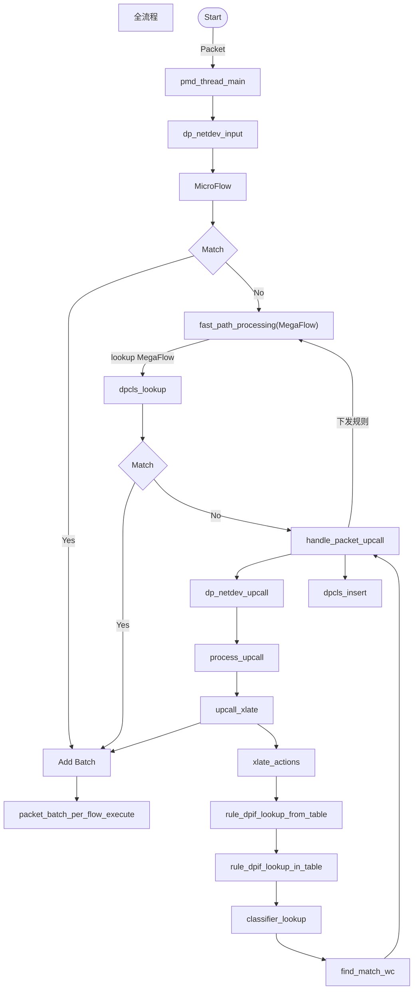

# The process of OVS processing packets


```C
struct flow {
    /* Metadata */
    struct flow_tnl tunnel;     /* Encapsulating tunnel parameters. */
    ovs_be64 metadata;          /* OpenFlow Metadata. */
    uint32_t regs[FLOW_N_REGS]; /* Registers. */
    uint32_t skb_priority;      /* Packet priority for QoS. */
    uint32_t pkt_mark;          /* Packet mark. */
    uint32_t dp_hash;           /* Datapath computed hash value. The exact
                                 * computation is opaque to the user space. */
    union flow_in_port in_port; /* Input port.*/
    uint32_t recirc_id;         /* Must be exact match. */
    uint8_t ct_state;           /* Connection tracking state. */
    uint8_t ct_nw_proto;        /* CT orig tuple IP protocol. */
    uint16_t ct_zone;           /* Connection tracking zone. */
    uint32_t ct_mark;           /* Connection mark.*/
    ovs_be32 packet_type;       /* OpenFlow packet type. */
    ovs_u128 ct_label;          /* Connection label. */
    uint32_t conj_id;           /* Conjunction ID. */
    ofp_port_t actset_output;   /* Output port in action set. */

    /* L2, Order the same as in the Ethernet header! (64-bit aligned) */
    struct eth_addr dl_dst;     /* Ethernet destination address. */
    struct eth_addr dl_src;     /* Ethernet source address. */
    ovs_be16 dl_type;           /* Ethernet frame type.
                                   Note: This also holds the Ethertype for L3
                                   packets of type PACKET_TYPE(1, Ethertype) */
    uint8_t pad1[2];            /* Pad to 64 bits. */
    union flow_vlan_hdr vlans[FLOW_MAX_VLAN_HEADERS]; /* VLANs */
    ovs_be32 mpls_lse[ROUND_UP(FLOW_MAX_MPLS_LABELS, 2)]; /* MPLS label stack
                                                             (with padding). */
    /* L3 (64-bit aligned) */
    ovs_be32 nw_src;            /* IPv4 source address or ARP SPA. */
    ovs_be32 nw_dst;            /* IPv4 destination address or ARP TPA. */
    ovs_be32 ct_nw_src;         /* CT orig tuple IPv4 source address. */
    ovs_be32 ct_nw_dst;         /* CT orig tuple IPv4 destination address. */
    struct in6_addr ipv6_src;   /* IPv6 source address. */
    struct in6_addr ipv6_dst;   /* IPv6 destination address. */
    struct in6_addr ct_ipv6_src; /* CT orig tuple IPv6 source address. */
    struct in6_addr ct_ipv6_dst; /* CT orig tuple IPv6 destination address. */
    ovs_be32 ipv6_label;        /* IPv6 flow label. */
    uint8_t nw_frag;            /* FLOW_FRAG_* flags. */
    uint8_t nw_tos;             /* IP ToS (including DSCP and ECN). */
    uint8_t nw_ttl;             /* IP TTL/Hop Limit. */
    uint8_t nw_proto;           /* IP protocol or low 8 bits of ARP opcode. */
    struct in6_addr nd_target;  /* IPv6 neighbor discovery (ND) target. */
    struct eth_addr arp_sha;    /* ARP/ND source hardware address. */
    struct eth_addr arp_tha;    /* ARP/ND target hardware address. */
    ovs_be16 tcp_flags;         /* TCP flags/ICMPv6 ND options type.
                                 * With L3 to avoid matching L4. */
    ovs_be16 pad2;              /* Pad to 64 bits. */
    struct ovs_key_nsh nsh;     /* Network Service Header keys */

    /* L4 (64-bit aligned) */
    ovs_be16 tp_src;            /* TCP/UDP/SCTP source port/ICMP type. */
    ovs_be16 tp_dst;            /* TCP/UDP/SCTP destination port/ICMP code. */
    ovs_be16 ct_tp_src;         /* CT original tuple source port/ICMP type. */
    ovs_be16 ct_tp_dst;         /* CT original tuple dst port/ICMP code. */
    ovs_be32 igmp_group_ip4;    /* IGMP group IPv4 address/ICMPv6 ND reserved
                                 * field.
                                 * Keep last for BUILD_ASSERT_DECL below. */
    ovs_be32 pad3;              /* Pad to 64 bits. */
};
```




# pmd_thread_main

>使用多线程的方式处理收包
>
>在开启或关闭端口时都会创建或回收相应的线程以完成收包，并执行相应的action


# MicroFlow

> 对应代码中的dfc_processing函数，主要包含EMC和SMC两种查询流程，如果查询到相应的规则，则将匹配到的流放入放入batch中，待当前packets处理完，批量执行action


# fast_path_processing

> 即MegaFlow匹配过程，如果MegaFlow完成匹配则将匹配到的规则加入batch，等待后续执行，
>
> 如果未匹配到则将当前packet传给upcall函数，进行openFlow流表的查找


# handle_packet_upcall

> 传入packet，调用upcall方法，查询openflow流表，并将查到的虚拟规则插入MegaFlow，并将相应的流插入MicroFlow
>
> 虚拟规则由两部分组成即Flow与对应的wc(wildcard)，并在下发MegaFlow的过程中由两者组成成相应的Value和mask
>
> Flow和wc都由upcall查询中修改

# process_upcall

> 从openFlow流表查询规则，并把规则相应规则的action插入batch中


# rule_dpif_lookup_from_table

> 依次访问每一个table查询相应的openFlow流，并返回查到的规则，同时对之前传入的flow与wc进行修改
>
>  
>
> 注：每个table相当于一个独立的classifier，classifier内部使用PSTSS结构，级包含多个Tuple
>
> 但是代码中在一个table中查找成功会直接返回，在此部分中并不确定，
>
> 我认为的流程应该是设置一个规则对应的wc(wildcard)，表示需要匹配处理的域，然后依次访问每个table，并且在转移到下一个table中应继续使用上个table处理后的掩码继续处理，最后根据Flow与相应的掩码，构成MegaFlow中的value和mask
>
> **文件最后附有该部分代码，并注释主要逻辑**


# classifier_lookup

> 在整个classifier中按照优先级依次查找各个Tuple，并返回优先级最高的规则


# find_match_wc

> 在单个Tuple内查询，主要使用分段查询和前缀树两个策略进行优化
>
> 查询过程：依次遍历每个分段，
>
> 根据每个分段，查询前缀树是否能查到当前Tuple中可以有规则进行匹配则，调用find_match方法查找相应的规则， find_match方法就是在Tuple内进行Cuckoo Hash查找的过程，


```C
rule_dpif_lookup_from_table

    // 依次遍历每个table，直到触发table终止信号TBL_INTERNAL
	for (next_id = *table_id;
         next_id < ofproto->up.n_tables;
         next_id++, next_id += (next_id == TBL_INTERNAL))
    {
        *table_id = next_id;
        // 在当前table中查询规则，其中最后一个参数wc代表规则对应的掩码，最后插入MegaFlow时也是根据Flow和wc还原value和mask
        rule = rule_dpif_lookup_in_table(ofproto, version, next_id, flow, wc);
        if (stats) {
            struct oftable *tbl = &ofproto->up.tables[next_id];
            unsigned long orig;

            atomic_add_relaxed(rule ? &tbl->n_matched : &tbl->n_missed,
                               stats->n_packets, &orig);
        }
        if (xcache) {
            struct xc_entry *entry;

            entry = xlate_cache_add_entry(xcache, XC_TABLE);
            entry->table.ofproto = ofproto;
            entry->table.id = next_id;
            entry->table.match = (rule != NULL);
        }
        // 查询到规则则返回Match
        if (rule) {
            goto out;   /* Match. */
        }
        
        // honor_table_miss 此参数来自上一级调用，并在上一级调用中赋值为常量True
        
         /* If 'honor_table_miss' is true, the first lookup occurs in '*table_id', but
         * if none is found then the table miss configuration for that table is
         * honored, which can result in additional lookups in other OpenFlow tables.
         * In this case the function updates '*table_id' to reflect the final OpenFlow
         * table that was searched. */
        if (honor_table_miss) {
            miss_config = ofproto_table_get_miss_config(&ofproto->up,
                                                        *table_id);
            if (miss_config == OFPUTIL_TABLE_MISS_CONTINUE) {
                continue;
            }
        }
        break;
    }
```

